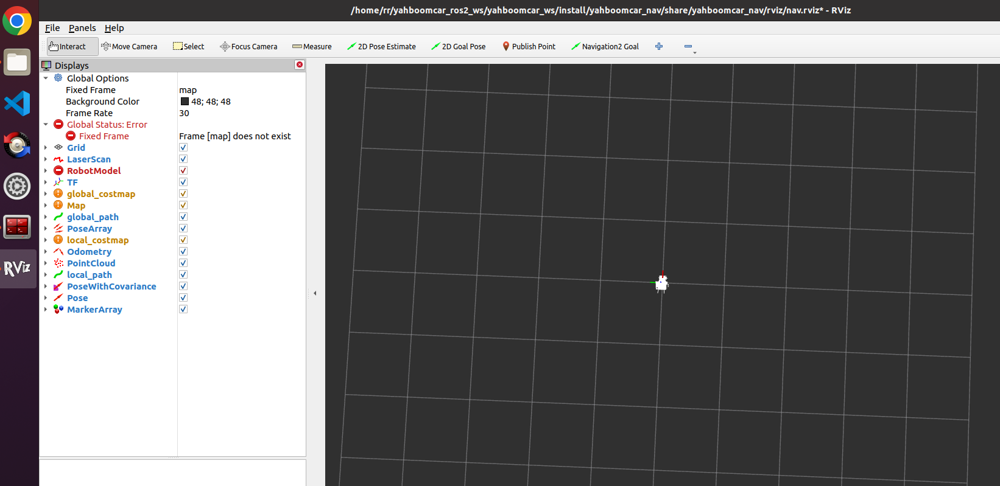
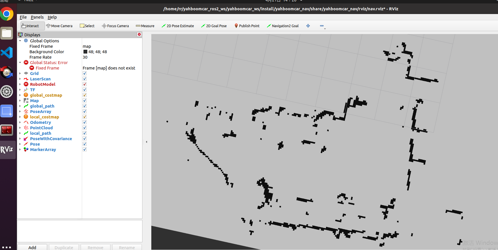
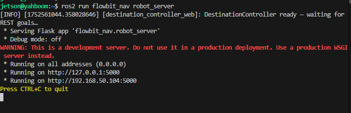

# More information can be found here: https://www.yahboom.com/build.html?id=6554&cid=529

# If you run into any issues consult this website:://www.yahboom.com/study/ROSMASTER-X3 

# First step: Map the environment and save 2D map for later use. 

7.2.2、具体使用
注意：建图时，速度慢一些效果越好（注要是旋转速度要慢些），速度太快，效果会很差。

首先在宿主机【也就是小车的jetson上】中需要做端口绑定操作【参见端口绑定教程章节】，这里主要用到雷达和串口两个设备；

然后检查雷达和串口设备是否处于端口绑定状态：在宿主机【也就是小车的jetson上】参考如下命令执行查看，成功绑定是如下状态：

image-20230421151543423 

若显示未绑定雷达或者串口设备，可以插拔一下USB连接线再次查看

 

树莓派PI5主控，需要先进入docker容器，Orin主控无须进入，

进入docker容器（步骤请参见【docker课程章节 ----- 5、进入机器人的docker容器】），

1、 启动建图

ros2 launch yahboomcar_nav map_cartographer_launch.py

2、启动rviz显示地图，这步建议在虚拟机中执行，虚拟机中需要配置好多机通讯

ros2 launch yahboomcar_nav display_map_launch.py

3、 启动键盘控制节点，这步建议在虚拟机中执行，虚拟机中需要配置好多机通讯

或者使用遥控器【缓慢移动小车】开始建图，直到建立好完整地图

ros2 run yahboomcar_ctrl yahboom_keyboard

4、地图保存，路径如下：

ros2 launch yahboomcar_nav save_map_launch.py

~/yahboomcar_ros2_ws/yahboomcar_ws/src/yahboomcar_nav/maps/

# Second step: Start navigation module using the saved map (latest map is loaded automatically)

8.2.2、启动底盘及雷达相关节点
首先在宿主机【也就是小车的jetson上】中需要做端口绑定操作【参见端口绑定教程章节】，这里主要用到雷达和串口两个设备；

然后检查雷达和串口设备是否处于端口绑定状态：在宿主机【也就是小车的jetson上】参考如下命令执行查看，成功绑定是如下状态：

image-20230421151543423 

若显示未绑定雷达或者串口设备，可以插拔一下USB连接线再次查看

 

树莓派PI5主控，需要先进入docker容器，Orin主控无须进入，

进入docker容器（步骤请参见【docker课程章节 ----- 5、进入机器人的docker容器】），

分终端执行：

ros2 launch yahboomcar_nav laser_bringup_launch.py

8.2.3、启动rviz显示地图
Ubuntu虚拟机和主机ros环境配置好多机通讯，这一步建议在虚拟机中启动：以保持时间同步和减少资源消耗，因为如果使用vnc的话很依赖于网络，可能导致导航失败的情况。

【注意，这里一定要先启动显示地图的节点，再启动步骤3中的导航节点，这是由于navigation2终端map话题只发布一次，如何先启动导航节点，再启动rviz显示，有可能会订阅不到那唯一一次发布的map话题，导致不显示地图】

ros2 launch yahboomcar_nav display_nav_launch.py

8.2.4. Start the navigation node
There are two navigation algorithms: DWA and TEB

Navigation can be divided into single-point navigation and multi-point navigation, which will be introduced below.

 

1. Start the navigation node and execute it in different terminals:

ros2 launch yahboomcar_nav navigation_dwa_launch.py    ​​# dwa navigation
or
ros2 launch yahboomcar_nav navigation_teb_launch.py    ​​# teb navigation

2. Click [2D Pose Estimate] on rviz, and then compare the car's position and give the car an initial position on the map;

The display after marking is as follows:

8.2.5 Single-point navigation
After the initial pose is set, you can click [2D Goal Pose] to set a navigation target point, and the car will start single-point navigation;

#Step 3 Clone and compile flowbot repository 

colcon build --packages-select flowbit_nav --symlink-install

source the new workspace 

source ~/flowbit/install/setup.bash 

launch the rest api server 

ros2 run flowbit_nav robot_server

#Step 4 send xyz coordinates from flowbit system as follows 

 curl -X POST http://127.0.0.1:5000/goal -H "Content-Type: application/json" -d '{"x": 0.0, "y": 0.0, "z": 0.0, "yaw": 1.57

