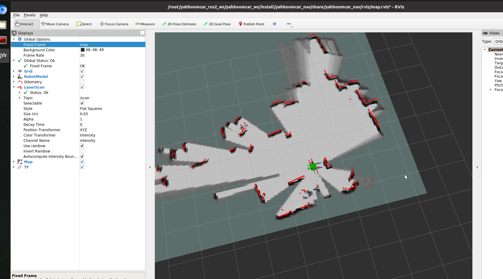
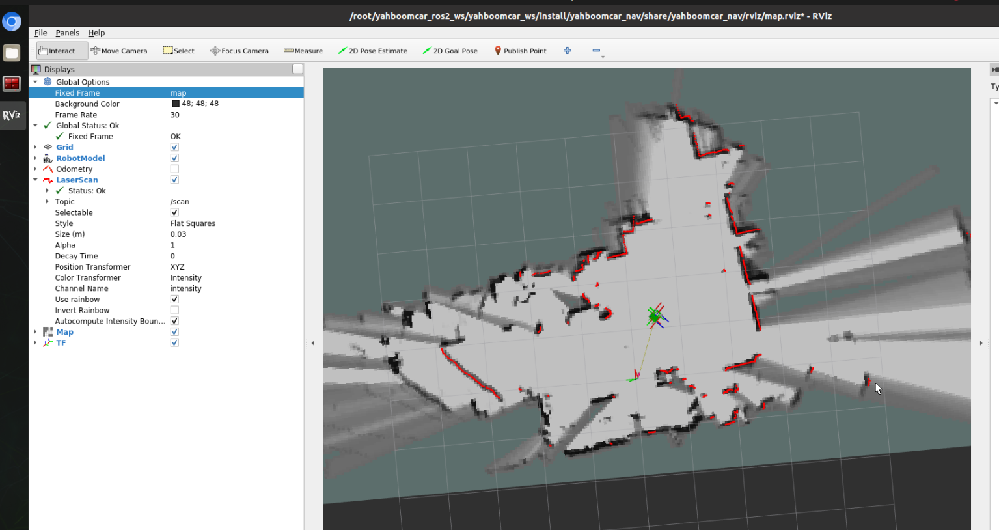
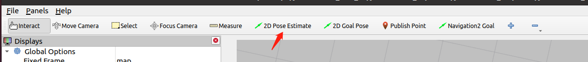
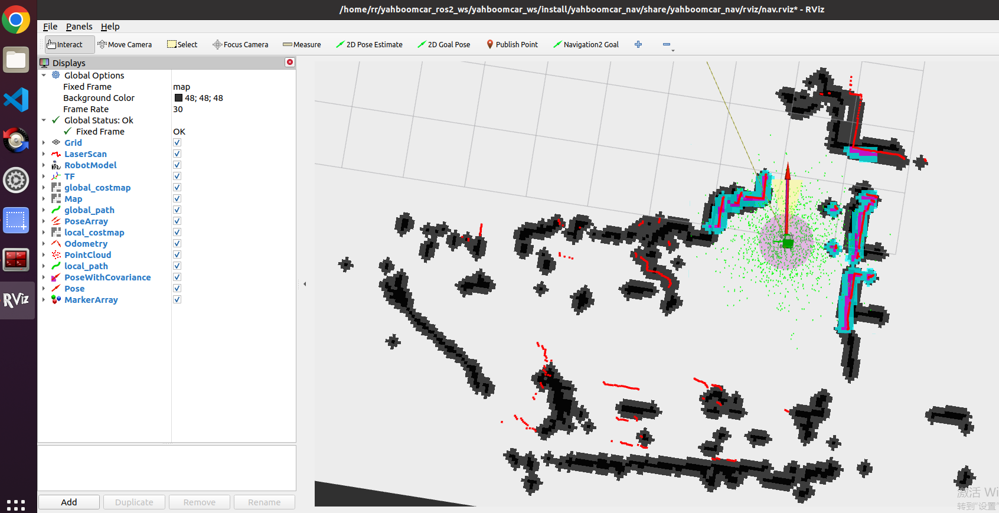

# ROS2 Project README

## Overview

This project involves mapping an environment and saving a 2D map for future use, as well as integrating with ROS2 to control the system using a keyboard or remote.

For more information, refer to the following resources:
- [Yahboom Build Instructions](https://www.yahboom.com/build.html?id=6554&cid=529)
- [ROS Master X3 Documentation](https://www.yahboom.com/study/ROSMASTER-X3)

## Requirements

Before proceeding, ensure you have the following:
- A robot running on a Jetson or Raspberry Pi.
- ROS2 installed and properly configured on your host machine.
- Devices such as a LiDAR sensor and serial port connected.
- A virtual machine configured for multi-machine communication, if required.

## Step-by-Step Instructions

### 1. Mapping the Environment

#### Important Notes:
- **Speed**: When creating the map, it's important to move at a slow speed for better accuracy. If the robot moves too quickly, the map quality will be poor.
- **Rotation Speed**: Ensure the rotation speed is slow for optimal results.

### 2. Starting the Mapping Process

- **Enter Docker Container (for Raspberry Pi 5)**: If you are using a Raspberry Pi 5 as the main controller, you must enter the Docker container first. For the Orin controller, there's no need to enter the container. Follow the [Docker Guide](link-to-guide) for instructions on entering the container.

- **Launch the Mapping Process**:
  ```bash
  ros2 launch yahboomcar_nav map_cartographer_launch.py
  ```
### 3. Displaying the Map
To visualize the map, use RViz. It's recommended to run this step on a virtual machine with multi-machine communication configured.

```bash
ros2 launch yahboomcar_nav display_map_launch.py
```



### 4. Control the Robot
You can control the robot using either a keyboard or a remote. If you use the keyboard, execute the following command:
```bash
ros2 run yahboomcar_ctrl yahboom_keyboard
```
Alternatively, you can use a remote to move the robot slowly and create the map.



### 5. Saving the Map
Once the map is completed, save it by launching the following command:

```bash
ros2 launch yahboomcar_nav save_map_launch.py
```
The saved map will be located at the following path:

```bash
~/yahboomcar_ros2_ws/yahboomcar_ws/src/yahboomcar_nav/maps/
```

## Second Step: Start Navigation Module Using the Saved Map

### 6. Start Chassis and LiDAR Nodes

Before starting, ensure that port binding has been completed on the host machine (Jetson, for example). This step is essential for both the LiDAR and serial devices.


- **Launch the LiDAR and Chassis Nodes**:
  ```bash
  ros2 launch yahboomcar_nav laser_bringup_launch.py
  ```

### 7. Display the Navigation Map in RViz
It is recommended to run this step on a virtual machine to maintain time synchronization and reduce resource consumption, as using VNC can lead to network-dependent issues, potentially causing navigation failures.

**Important**: Always start the map display node first before launching the navigation node. If you start the navigation node before RViz, it may fail to subscribe to the map topic, causing the map not to display.

Launch the Map Display in RViz:

```bash
ros2 launch yahboomcar_nav display_nav_launch.py   
```


### 8. Start the Navigation Node
There are two types of navigation algorithms available: DWA (Dynamic Window Approach) and TEB (Timed Elastic Band). Navigation can be further divided into:

* Single-point navigation

* Multi-point navigation

For our case we only care about the Single-point navigation. 


### 8.1 Start the Navigation Node

There are two navigation algorithms: **DWA** (Dynamic Window Approach) and **TEB** (Timed Elastic Band).

Navigation can be divided into **single-point navigation** and **multi-point navigation**, which will be explained below.

1. **Start the navigation node and execute it in different terminals:**

    For **DWA** navigation:
    ```bash
    ros2 launch yahboomcar_nav navigation_dwa_launch.py  # dwa navigation
    ```
    For **TEB** navigation:
    ```bash
    ros2 launch yahboomcar_nav navigation_teb_launch.py  # teb navigation
    ```
    

2. **Set the initial pose in RViz:***

    Click on [2D Pose Estimate] in RViz, then compare the car's position and provide the car with an initial position on the map.

    

    The display after marking the pose will look like this:

    

3. **Expand the thickness of the borders by running the following command:**
    ```bash
    ros2 param set /global_costmap/global_costmap inflation_layer.inflation_radius 0.30
    ```


## Step 3: Clone and Compile Flowbot Repository

To compile the **flowbot_nav** package, execute the following commands:

```bash
colcon build --packages-select flowbit_nav --symlink-install
```

After building the package, source the new workspace:

```bash
source ~/flowbit/install/setup.bash
```

Then, launch the REST API server:

```bash
ros2 run flowbit_nav robot_server
```


## Step 4: Send XYZ Coordinates from Flowbit System

Now you can send coordinates from the flowbit system to the robot using the rest api. Here is an example using curl. 
```bash 
curl -X POST http://127.0.0.1:5000/goal -H "Content-Type: application/json" -d '{"x": 0.0, "y": 0.0, "z": 0.0, "yaw": 1.57}'
```
